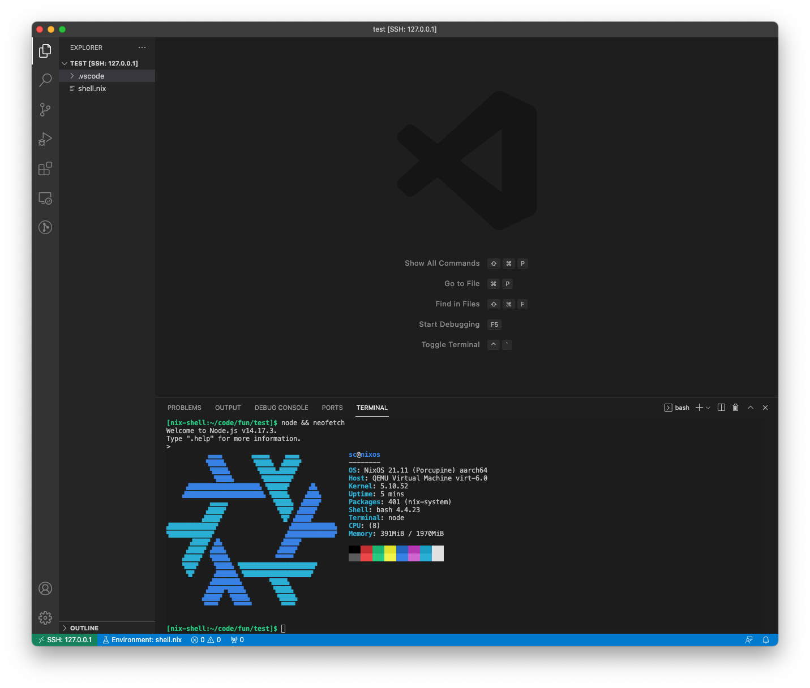

+++
title = "M1 dev setup using a NixOS virtual machine"
date = 2021-08-01
+++

For the last two months I have been doing dev work on an M1 MacBook Air. Kind of a big change in retrospective, having used Linux in bare metal almost uninterruptedly for 10 years, give or take. Needless to say at this point, the hardware is great and the main reason that made me go with it, and I did not find any blockers on the software side for the things I normally do.

One of the reasons I suspect made everything a bit smoother is being prepared to leverage my comfort using Linux to set up a [virtual machine](https://gopensource.com/m1-dev-setup-with-a-virtual-linux-box-1a2688231667?gi=1e171b8d2228) with [UTM](https://mac.getutm.app/) (a frontend for [QEMU](https://www.qemu.org/) in macOS) or [Docker containers](https://code.visualstudio.com/docs/remote/containers) using the Docker Desktop app for my work. Given that Docker in macOS uses virtualization to run a Linux kernel anyway, I decided to go with the "bare" VM approach for more ~~tinkering~~ control.

[NixOS](https://nixos.org/) and Nix were also things I wanted to start using more instead of on-and-off experiments as I was doing. I feel like giving even an intro to these projects would make this post quite long because they can do [a lot](https://nix.dev)! But I can mention that I felt attracted to try them, among other things, because I can:

- handle multiple development environments with [`nix-shell`](https://nix.dev/tutorials/declarative-and-reproducible-developer-environments);
- backup my `configuration.nix` file and treat my VM as something I can torch whenever I want - for the most part, the VM "state" and configuration including programs are encapsulated there in a declarative form;
- have a "reasonable" level of reproducibility within reach by pinning `nixpkgs` to a commit hash;
- start with a console-only NixOS VM that I SSH into, and use its configuration as a baseline in case I want to run NixOS in the Air natively by the time Linux is ready for it ([soon™](https://asahilinux.org/)), adding a [graphical session](https://twitter.com/mitchellh/status/1346136404682625024) and stuff like that.

By the time I started looking into running NixOS using UTM, I could not find a proper ISO to boot with, so I went with Ubuntu + Nix to hit the ground running. This week I decided to search again and I finally could find an image in the [UEFI](https://nixos.wiki/wiki/NixOS_on_ARM/UEFI) section of [NixOS on ARM](https://nixos.wiki/wiki/NixOS_on_ARM). I do not know why I did not find it earlier, but eh. Incidentally I also found another reference in a [blog post](https://grahamc.com/blog/nixos-on-framework) by a NixOS dev this week.

So the [release](https://hydra.nixos.org/jobset/nixos/release-21.05#tabs-jobs) and [unstable](https://hydra.nixos.org/jobset/nixos/trunk-combined#tabs-jobs) ISOs can be found at Hydra, NixOS' CI tool. Search for "`nixos.iso_minimal`" there and you will get the latest built ones. I went with the `nixos.iso_minimal_new_kernel.aarch64-linux` from the unstable branch, mainly because I can roll back to a previous machine state easily from the boot menu if something breaks, but I imagine going with the release version would be OK as well. You can always [pick single packages](https://discourse.nixos.org/t/installing-only-a-single-package-from-unstable/5598) from unstable if you want to.

After downloading and mounting the ISO in a newly created VM, I followed the [installation section](https://nixos.org/manual/nixos/stable/index.html#sec-installation) of the manual pretty much verbatim. I did not have to configure GRUB as stated in the ARM section of the wiki for this setup. Also, take into account that you have to forward port 22 (or the one you use for SSH) to some other local port in your machine in the configuration of the VM in UTM to access it from macOS.

A big downside of committing to the Nix way of things at this point in time is that fixing broken things might need learning the language and digging through docs and issues which are not always clear or complete. So far though, I found no such thing while working with Node.js, Docker, Docker Compose and VSCode through SSH. The VM is really snappy and, as a small curiosity, it does not show up in the list of apps using "significant battery" where Docker Desktop would be at all times! For the occasional container that only has a x86_64 version I can always set up another VM with NixOS amd64 to replace the one I already have with [Alpine](https://alpinelinux.org/), but I do not see the urgent need for it.

Keep in mind running Nix in macOS is also an option, one that is being nicely shaped thanks to the [Nix 🖤 macOS Open Collective](https://discourse.nixos.org/t/nix-macos-monthly/12330). As far as I read, it can work as a replacement for [Homebrew](https://brew.sh/). Some [nice](https://github.com/NixOS/nix/pull/4289#issuecomment-842797556) things might still need to wait for a backport or a new Nix release though. For me, needing Docker already made me go with the VM approach instead, and after some time I find the logical separation of integrated OS apps and the dev environment "cozy", if that makes any sense.

A couple of things I recommend complementing this setup with:

- The [Nix Environment Selector](https://marketplace.visualstudio.com/items?itemName=arrterian.nix-env-selector) extension to make VSCode aware of the development environment defined in `shell.nix` files, so that it can use things declared there and not in the general system configuration.
- [Code Server support for NixOS](https://github.com/msteen/nixos-vscode-server).

Finally, here's my current [`configuration.nix`](https://gist.github.com/santicalcagno/1860b709f0e91c861ba8f59fcad5613c) file in case it helps with anything. Not much added from the base one though.
